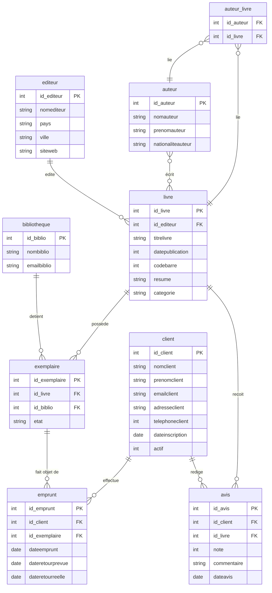

```mermaid
erDiagram
    bibliotheque {
        int id_biblio PK
        string nombiblio
        string emailbiblio 
    }
    editeur {
        int id_editeur PK
        string nomediteur
        string pays
        string ville
        string siteweb
    }
    livre {
        int id_livre PK
        int id_editeur FK
        string titrelivre
        int datepublication
        int codebarre 
        string resume
        string categorie
    }
    auteur {
        int id_auteur PK
        string nomauteur
        string prenomauteur
        string nationaliteauteur
    }
    auteur_livre {
        int id_auteur FK
        int id_livre FK
    }
    exemplaire {
        int id_exemplaire PK
        int id_livre FK
        int id_biblio FK
        string etat
    }
    client {
        int id_client PK
        string nomclient
        string prenomclient
        string emailclient
        string adresseclient
        int telephoneclient
        date dateinscription
		int actif
    }
    emprunt {
        int id_emprunt PK
        int id_client FK
        int id_exemplaire FK
        date dateemprunt
        date dateretourprevue
        date dateretourreelle
    }
    avis {
        int id_avis PK
        int id_client FK
        int id_livre FK
        int note
        string commentaire
        date dateavis
    }

    editeur      ||--o{ livre        : "edite"
    auteur       }o--o{ livre        : "écrit"
    auteur_livre }o--|| auteur        : "lie"
    auteur_livre }o--|| livre         : "lie"
    livre        ||--o{ exemplaire   : "possede"
    bibliotheque ||--o{ exemplaire   : "detient"
    exemplaire   ||--o{ emprunt      : "fait objet de"
    client       ||--o{ emprunt      : "effectue"
    client       ||--o{ avis         : "redige"
    livre        ||--o{ avis         : "recoit"
```