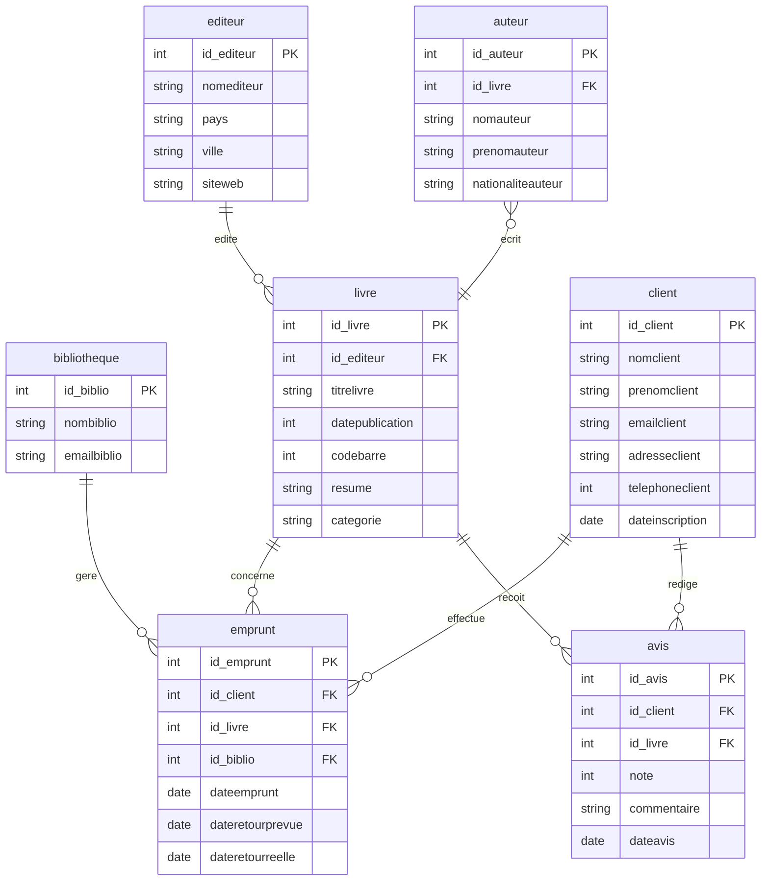

```mermaid

erDiagram
    bibliotheque {
        int id_biblio PK
        string nombiblio
        string emailbiblio
    }
    livre {
        int id_livre PK
        int id_editeur FK
        string titrelivre
        int datepublication
        int codebarre
        string resume
        string categorie
    }
    editeur {
        int id_editeur PK
        string nomediteur
        string pays
        string ville
        string siteweb
    }
    auteur {
        int id_auteur PK
        int id_livre FK
        string nomauteur
        string prenomauteur
        string nationaliteauteur
    }
    client {
        int id_client PK
        string nomclient
        string prenomclient
        string emailclient
        string adresseclient
        int telephoneclient
        date dateinscription
    }
    emprunt {
        int id_emprunt PK
        int id_client FK
        int id_livre FK
        int id_biblio FK
        date dateemprunt
        date dateretourprevue
        date dateretourreelle
    }
    avis {
        int id_avis PK
        int id_client FK
        int id_livre FK
        int note
        string commentaire
        date dateavis
    }

    editeur ||--o{ livre : "edite"
    auteur }o--|| livre : "ecrit"
    client ||--o{ emprunt : "effectue"
    livre ||--o{ emprunt : "concerne"
    bibliotheque ||--o{ emprunt : "gere"
    client ||--o{ avis : "redige"
    livre ||--o{ avis : "recoit"

```
